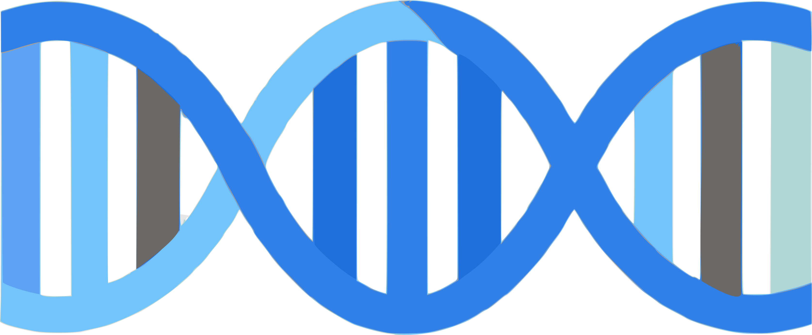

<!-- README.md is generated from README.Rmd. Please edit that file -->

```{r, include = FALSE}
knitr::opts_chunk$set(
  collapse = TRUE,
  comment = "#>",
  fig.path = "man/figures/README-",
  out.width = "100%"
)
```

# Genetic Data Analysis 

[](https://nsf.gov/awardsearch/showAward?AWD_ID=2132247)
[](https://creativecommons.org/licenses/by-nc/4.0/)

Website URL: <https://dcgerard.github.io/gda/>

This website contains a series of lectures on genetic data analysis, taught by [David Gerard](https://dcgerard.github.io/), at his research group meetings during the 2021--2022 academic year.

Topics include

- The first three chapters from @weir1996genetic, covering frequency estimation, Hardy-Weinberg testing, and LD estimation and testing from a statistical point of view.

- Chapters 1, 2, and 5 from @gillespie2004population, covering Hardy-Weinberg, genetic drift, mutation, and non-random mating.

- An introduction to the EM algorithm, with an application from @li2011statistical.

- An introduction to Bayesian inference.

- A discussion of @li2003modeling.

I am placing these lecture notes under a CC BY-NC 4.0 licence, so you can use them as long as you provide attribution.

## Acknowledgments

This material is based upon work supported by the National Science Foundation under Grant No. [2132247](https://www.nsf.gov/awardsearch/showAward?AWD_ID=2132247). The opinions, findings, and conclusions or recommendations expressed are those of the author and do not necessarily reflect the views of the National Science Foundation.

# References
