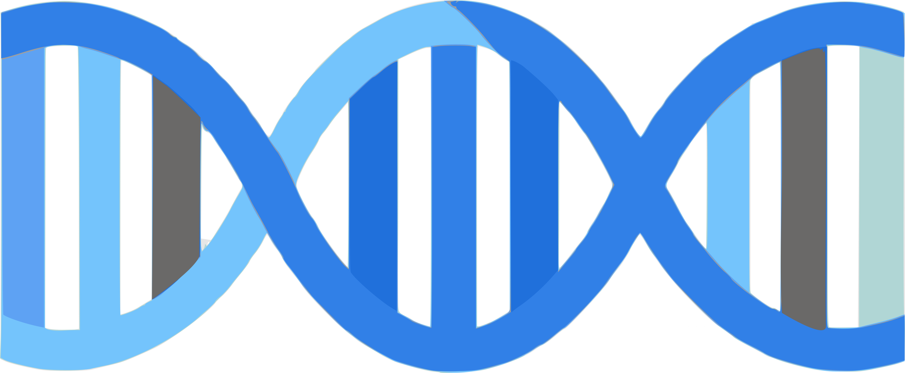

<!-- README.md is generated from README.Rmd. Please edit that file -->

# Genetic Data Analysis 

Website URL: <https://dcgerard.github.io/gda/>

This website contains a series of lectures on genetic data analysis,
taught by [David Gerard](https://dcgerard.github.io/), at his research
group meetings during the 2021–2022 academic year.

Topics include

-   The first three chapters from Weir (1996), covering frequency
    estimation, Hardy-Weinberg testing, and LD estimation and testing
    from a statistical point of view.

-   Chapters 1, 2, and 5 from Gillespie (2004), covering Hardy-Weinberg,
    genetic drift, mutation, and non-random mating.

-   An introduction to the EM algorithm, with an application from H. Li
    (2011).

-   An introduction to Bayesian inference.

-   A discussion of N. Li and Stephens (2003).

I am placing these lecture notes under a CC BY-NC 4.0 licence, so you
can use them as long as you provide attribution.

## Acknowledgments

This material is based upon work supported by the National Science
Foundation under Grant
No. [2132247](https://www.nsf.gov/awardsearch/showAward?AWD_ID=2132247).
The opinions, findings, and conclusions or recommendations expressed are
those of the author and do not necessarily reflect the views of the
National Science Foundation.

# References

Gillespie, J. H. 2004. *Population Genetics: A Concise Guide*.
Population Genetics. Johns Hopkins University Press.
<https://books.google.com/books?id=KAcAfiyHpcoC>.

Li, Heng. 2011. “A Statistical Framework for SNP Calling, Mutation
Discovery, Association Mapping and Population Genetical Parameter
Estimation from Sequencing Data.” *Bioinformatics* 27 (21): 2987.
<https://doi.org/10.1093/bioinformatics/btr509>.

Li, Na, and Matthew Stephens. 2003. “Modeling Linkage Disequilibrium and
Identifying Recombination Hotspots Using Single-Nucleotide Polymorphism
Data.” *Genetics* 165 (4): 2213–33.
<https://doi.org/10.1093/genetics/165.4.2213>.

Weir, B. S. 1996. *Genetic Data Analysis II: Methods for Discrete
Population Genetic Data*. Sinauer Series. Sinauer.
<https://books.google.com/books?id=e9QPAQAAMAAJ>.

